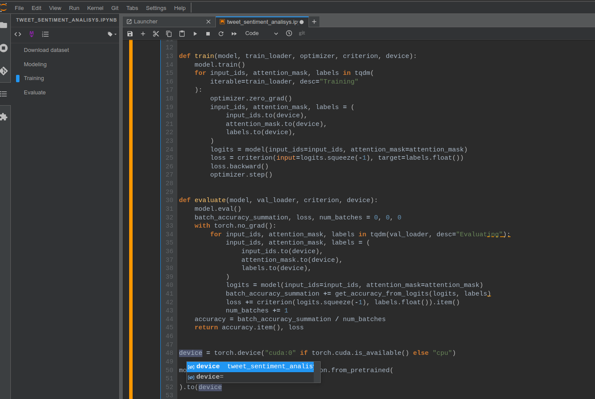

# JupyterLab Notebook with Pytorch

This docker image for jupyterlab, pytorch and cuda.



## Run the container

### Basic usage:
```
docker run --rm \                       # remove the container when it exits
           -it \                        # pseudo-TTY
           -p 8888:8888 \               # port forwarding: <Host>:<Container>
           --gpus all \                 # support all gpus
           -v /local_vol:/docker_vol \  # volume: mapping local folder to container
           -e JUPYTER_TOKEN=passwd \    # Jupyter password: passwd
           -e SYS_MEM_LIMIT=16 \        # Set the monitoring memory limit
           -e SYS_CPU_LIMIT=8 \         # Set the monitoring cpu limit
           -d rodrigobaron/torch-notebook:latest
```

### Start CPU only container:
```
docker run --rm -it  \
           -p 8888:8888  \
           rodrigobaron/torch-notebook:latest
```

### Start the container with GPUs support:
```
docker run --rm -it  \
           --gpus all  \
           -p 8888:8888  \
           rodrigobaron/torch-notebook:latest
```

## Extensions enabled

The containe contains simple but powerfull extensions enablind productivity boosting.  
See the extension list above:  

* [jupyterlab-lsp](https://github.com/jupyter-lsp/jupyterlab-lsp): Turn jupyter notebook into IDE like, documentation inspecting, diagnostics, code complection..
* [jupyterlab-git](https://github.com/jupyterlab/jupyterlab-git): Brings git commands and visualization tools.
* [jupyterlab-system-monitor](https://github.com/jtpio/jupyterlab-system-monitor): display system infomation (memory and cpu usage).
* jupyterlab/debugger: Enable debugging and tracing.
* [aquirdturtle_collapsible_headings](https://github.com/aquirdTurtle/Collapsible_Headings): Make headings collapsible like Mathematica notebooks.
* [jupyterlab_execute_time](https://github.com/deshaw/jupyterlab-execute-time):  Display cell timings.

Using [darcula](https://github.com/telamonian/theme-darcula) theme as default.